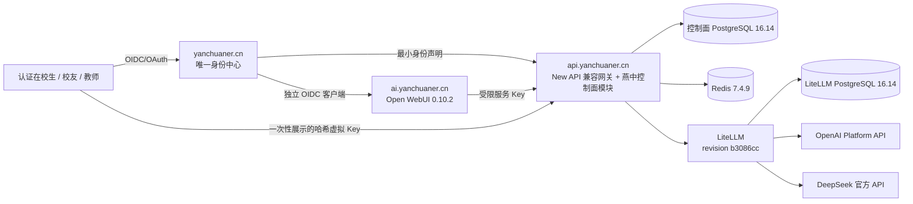

# 燕中 AI/API 现状、数据流与风险

审计基线：2026-07-19。代码结论以 `origin/main`、Git 历史、锁文件和镜像清单为依据，不以产品说明代替实现证据。

## 现状架构

## P0 数据流

1. 主站只向受信任的 `yanchuaner` OAuth 提供方返回 `sub`、邮箱、验证状态和粗粒度角色。
2. 首次登录在创建本地用户的同一事务中追加 `grant` 公益额度流水；`users.quota` 是兼容投影。
3. 新虚拟 Key 以 `sk-yc_<64 hex>` 返回一次；数据库只保存 `sha256:<digest>`、前缀和尾号。
4. 请求认证先哈希提交的虚拟 Key，再读取兼容 Token 记录；数据库哈希本身不能作为 bearer token 重放。
5. 标准文本请求按同一 `request_id` 追加 `reserve`、可选 `settlement` 或 `refund` 流水，并继续写 New API 用量日志。
6. LiteLLM 只负责路由、重试和上游成本核对，不再次扣减用户余额。

当前 Open WebUI 仍使用服务 Key，API 侧不能据此识别最终聊天用户。开放到普通成员前必须完成用户级委托或可信身份传播，不能把共享服务 Key 日志描述成个人账单。

## 版权边界

- New API 基线和改动继续受 AGPLv3、`NOTICE` 第 7 条附加署名要求及第三方许可证约束。
- `model/yanchuaner_*.go`、`controller/yanchuaner_quota_ledger.go` 及对应测试是燕中生态本轮独立设计的新文件，当前随本 AGPL 仓库按 AGPLv3-or-later 分发；这不改变 New API 原代码的版权。
- LiteLLM、Open WebUI、PostgreSQL 和 Redis 是独立镜像/进程，不声明为燕中原创。
- 运营主体和贡献协议尚未确定，因此不能宣称组织统一持有所有贡献版权，也不能把当前 AGPL 模块事后无条件改为其他许可证。

完整清单见 [版权与来源矩阵](copyright-matrix.md)。

## 关联仓库治理现状

- `web_yanchuaner` 当前仓库 `LICENSE` 声明 MIT，并已有 `SECURITY.md` 与 `CONTRIBUTING.md`；未发现 `THIRD_PARTY_NOTICES`，其 npm/Prisma 等依赖仍需单独生成许可清单，不能仅凭仓库 MIT 文件覆盖第三方依赖。
- `ai_yanchuaner` 本轮已补自主内容许可状态、第三方许可全文、来源矩阵、依赖基线、安全与贡献说明；最终自主许可证仍待运营主体和贡献政策确认。
- `yczx_code` 当前主要是产品/学习文档，未发现仓库 `LICENSE`、`SECURITY.md` 或 `CONTRIBUTING.md`；开始实现 Agent Core 前应先建立依赖、来源和贡献基线。
- `C:\Dev\yanchuaner\docs\燕中生态项目关系.txt` 所在目录不是独立 Git 仓库；受版本控制的真值副本位于 `web_yanchuaner/docs/燕中生态项目关系.txt`，两者须保持内容一致。

## 主要风险

| 优先级 | 风险 | 当前证据与门禁 |
| --- | --- | --- |
| P0 | Open WebUI 品牌许可 | `0.10.2` 许可证仅在滚动 30 日不超过 50 名最终用户、书面许可或企业许可三种条件之一满足时允许改动品牌。公开预览前必须归档证据；否则恢复合规品牌或限制人数。 |
| P0 | 原创产品入口尚未完成 | 阶段 1 已开始实现 YanCore 主体协议；缺少 Open WebUI 品牌授权不阻止自主研发，但 Open WebUI 不能继续作为燕中原创产品入口公开扩张。 |
| P0 | 集成生产验收未完成 | SQLite 镜像启动迁移、PostgreSQL 16.14 流水/Token 列迁移和完整 Docker 镜像构建已通过；真实主站 OIDC、OpenAI/DeepSeek 调用、MySQL 兼容、备份恢复和回滚演练仍未完成，完成前不得上线。 |
| P0 | 旧 Key 仍为明文 | 本次只保证新建燕中虚拟 Key 为哈希。既有 Token 必须盘点、轮换和撤销，不能原地转换后继续向用户展示同一秘密。 |
| P0 | AI 工作台个人归因缺失 | Open WebUI 服务 Key 只能形成服务账户账单；普通成员开放前需要用户委托或逐用户 Key。 |
| P0 | 许可仍待法律与运营确认 | `ai_yanchuaner` 已补仓库许可状态、第三方许可全文、来源矩阵和安全/贡献流程；运营主体、自主代码最终许可证、Open WebUI 法律声明页和品牌授权仍须人工确认。 |
| P1 | 每 Key RPM/TPM 未完成 | 现有 New API 只支持用户/分组级请求限流。虚拟 Key 独立 RPM、TPM 和并发限制必须在开放 Agent 前实现。 |
| P1 | 权益来源尚未拆分 | 当前新流水只迁移 `public_benefit`。活动权益、兑换码和 BYOK 不能复用同一余额静默扣减。 |
| P1 | 供应商边界依赖 group | 当前供应商限制主要通过 New API group/渠道配置表达；需要独立 provider allowlist 和路由后复核。 |
| P1 | Redis 许可证 | `7.4.9` 为 RSALv2/SSPLv1 双许可。只允许作为不暴露给用户的内部缓存；禁止把 Redis 功能本身作为服务提供。 |
| P2 | 上游共享状态测试失败 | 未修改基线也会出现 `channel_affinity_usage_cache_test` 计数污染。应修复测试隔离，但不阻塞本轮新增行为的定向测试。 |
| P2 | 本地前端依赖布局易混用 | 同一 Windows `node_modules` 无法同时代表 default 与 classic 的发布安装。发布以 Dockerfile 的隔离阶段为准，详见 `dependency-baseline.md`。 |
| P2 | 关联仓库治理不齐 | 主站缺第三方许可清单，YCZX Code 缺许可证/安全/贡献入口；在相应仓库新增依赖或可执行代码前补齐。 |

本文件是工程审计，不替代律师对许可证、品牌授权或运营主体资格的意见。
